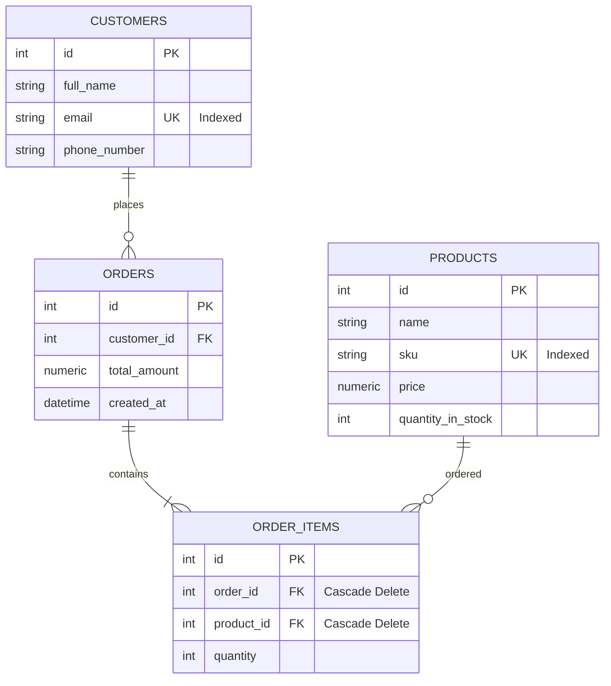

# ApexStock: Premium Inventory & Order Management System

ApexStock is a production-ready, beautiful, and transactional **monorepo-based Inventory & Order Management System**. It features a modern FastAPI (Python) backend, a high-fidelity React Single Page Application (SPA) frontend built on Vite, and a PostgreSQL database. The entire ecosystem is orchestrated container-by-container via Docker Compose.

---

## 🚀 Instant Local Run

To boot up the complete production-ready application environment (PostgreSQL + FastAPI + Vite Nginx Frontend), simply execute:

```bash
docker-compose up --build
```

- **Frontend Application**: `http://localhost:3000`
- **FastAPI Core Swagger Documentation**: `http://localhost:8000/docs`
- **Database Engine**: `localhost:5432`

---

## 🛠️ Architecture Stack

### Backend Service (`/backend`)
- **FastAPI**: Modern, fast (high-performance) web framework for building APIs.
- **SQLAlchemy (ORM)**: High-performance database operations and entity modeling.
- **Pydantic v2**: Structured input validation and response schemas.
- **Transactional Consistency**: Multi-item orders are placed inside transactional context limits. Row locks (`with_for_update()`) prevent concurrent overdraft double-spending and ensure complete rollback on validation failures.

### Frontend Client (`/frontend`)
- **Vite + React (JS)**: Superfast compile times, client-side SPA routing (`react-router-dom`).
- **Axios**: Clean API communications featuring centralized error interception.
- **High-Fidelity CSS (Vanilla)**: Fully-responsive custom design system with support for dark-mode cards, loading skeletons, alert animations, modal screens, and low stock indicators.

---

## 📊 Database Schema Entity-Relationship

The database scheme contains optimized indexes and cascades to manage transactions safely:



---

## ⚙️ Environment Configuration

Copy the sample configuration to initialize environment settings:

```bash
cp .env.example .env
```

| Key | Default Value | Purpose |
| :--- | :--- | :--- |
| `DB_USER` | `postgres` | Username for database administrator. |
| `DB_PASSWORD` | `postgres` | Password for database administrator. |
| `DB_NAME` | `inventory_db` | Name of the schema to load. |
| `CORS_ORIGINS` | `http://localhost:3000,http://localhost:5173` | Allowed CORS headers origins (comma separated). |
| `DATABASE_URL` | *derived in docker-compose* | Full connection string for DB session. |

---

## ☁️ Deployment Guides

### 1. Backend Service (Deploying on Render)
Render natively compiles Python services:
1. Connect your Github Repository to Render.
2. Create a new **Web Service** on Render.
3. Configure the following deployment parameters:
   - **Environment**: `Python`
   - **Build Command**: `pip install -r backend/requirements.txt`
   - **Start Command**: `uvicorn backend.app.main:app --host 0.0.0.0 --port $PORT`
4. Add the following **Environment Variables** in the Render settings:
   - `DATABASE_URL`: Your production PostgreSQL database connection URI (e.g. Render's hosted PostgreSQL service).
   - `CORS_ORIGINS`: Address of your compiled frontend service (e.g., `https://apexstock.vercel.app`).
   - `ENV`: `production`

### 2. Frontend Client (Deploying on Vercel)
Vercel is built for static single-page React projects compiled using Vite:
1. Connect your Github Repository to Vercel.
2. Select **New Project** and import the monorepo.
3. Configure the deployment settings:
   - **Framework Preset**: `Vite`
   - **Root Directory**: `frontend`
   - **Build Command**: `npm run build`
   - **Output Directory**: `dist`
4. Add the following **Environment Variables**:
   - `VITE_API_URL`: The live URL of your Render backend service (e.g., `https://apexstock-backend.onrender.com`).
5. Click **Deploy**. Vercel will build and serve your SPA globally.

---

## 💼 Core Business Rules Checked
- **Unique SKU Checks**: Handled gracefully. Duplicate catalog attempts trigger a `400 Bad Request` block.
- **Stock Depletion Reversal (Rollbacks)**: Order transactions verify stock availability for *all* items before deducting inventory. If *one* item fails verification, the *entire* order fails, and stock levels are untouched (100% atomic transactions).
- **Stock Restoration**: Deleting/cancelling an order automatically reverses all item reductions, restoring stock levels.
